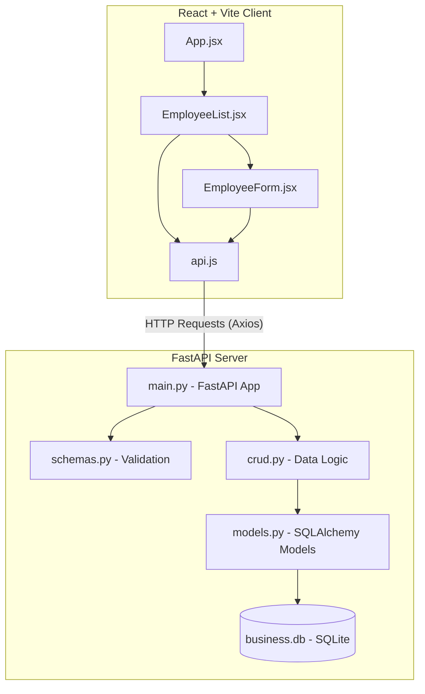

# Nexus Business Platform - Employee Management System

Welcome to the **Nexus Business Platform**, a modern, full-stack Enterprise Resource Management (ERM) system designed for managing employee records. This project features a robust **FastAPI** backend with a **SQLite** database and a clean, responsive **React + Vite** frontend.

---

## 🏗️ System Architecture & Workflow

The project is structured as a decoupled client-server architecture:



---

## 🛠️ Tech Stack & Dependencies

### 1. Backend (FastAPI API)
*   **FastAPI**: A modern, fast, high-performance web framework for building APIs with Python.
*   **Uvicorn**: An ASGI web server implementation for Python, used to serve the FastAPI app.
*   **SQLAlchemy**: The SQL Toolkit and Object-Relational Mapper (ORM) used to interact with the SQLite database.
*   **Pydantic**: Data validation and settings management using Python type annotations.
*   **Faker**: Used to seed the database with realistic mock employee records.
*   **Pytest & TestClient**: For writing and executing automated unit and integration tests.

### 2. Frontend (React UI)
*   **React 19**: A popular JavaScript library for building user interfaces.
*   **Vite 8**: A fast frontend tool and bundler for modern web projects.
*   **Axios**: A promise-based HTTP client for making API requests to the FastAPI backend.
*   **Lucide React**: A collection of beautiful, clean icons used across the UI.
*   **Vanilla CSS**: Custom CSS (`index.css` and `App.css`) for styling, using CSS custom variables for thematic styling and animations.

---

## 📁 Project Directory Structure

```text
Employee_Management/
├── README.md                 # Root documentation (this file)
├── backend/                  # FastAPI Backend Application
│   ├── business.db           # SQLite Database (contains seeded data)
│   ├── crud.py               # Create, Read, Update, Delete database logic
│   ├── database.py           # SQLAlchemy database connection & session setup
│   ├── main.py               # FastAPI application entry point and routing
│   ├── models.py             # SQLAlchemy database model definitions
│   ├── schemas.py            # Pydantic validation schemas
│   ├── seed.py               # Script to seed the database with mock records
│   ├── test_api.py           # Automated pytest test suite
│   └── venv/                 # Python Virtual Environment
└── frontend/                 # React Frontend Application
    ├── README.md             # Frontend-specific documentation
    ├── package.json          # Frontend npm dependencies and scripts
    ├── index.html            # Main HTML page entry point
    ├── vite.config.js        # Vite build configuration
    ├── eslint.config.js      # ESLint code quality configuration
    └── src/                  # React application source code
        ├── main.jsx          # React app DOM entry mount
        ├── App.jsx           # Main layout component
        ├── App.css           # Styling for main layouts
        ├── index.css         # Global design system & theme tokens
        ├── components/       # UI Components
        │   ├── EmployeeList.jsx # Paginated table view, search, and action triggers
        │   └── EmployeeForm.jsx # Add/Edit modal form with validation
        └── services/         # API Service Integrations
            └── api.js        # Axios instance and API call functions
```

---

## 💾 Database Schema

The SQLite database (`business.db`) contains an `employees` table defined by the following schema:

| Column Name | Database Type | Description | Pydantic Validation / Constraints |
| :--- | :--- | :--- | :--- |
| `id` | Integer (PK) | Unique employee identifier | Auto-incremented primary key |
| `first_name` | String | Employee's first name | Required, indexed |
| `last_name` | String | Employee's last name | Required, indexed |
| `email` | String | Employee's email address | Required, Unique index, Valid Email format |
| `department` | String | Work department | Required, indexed (e.g., Engineering, HR) |
| `role` | String | Employee job role | Required |
| `salary` | Float | Employee annual salary | Required, minimum `0` |
| `is_active` | Boolean | Employment status | Optional (defaults to `True`) |
| `hire_date` | Date | Date employee was hired | Required date format |

---

## 🔌 API Endpoints (FastAPI)

The API is fully documented automatically at `http://localhost:8000/docs` (Swagger UI) when the backend is running.

| Method | Endpoint | Description | Request Body / Query Params |
| :--- | :--- | :--- | :--- |
| **POST** | `/employees/` | Create a new employee record | `EmployeeCreate` (JSON body) |
| **GET** | `/employees/` | Retrieve a list of employees | Params: `skip` (default 0), `limit` (default 100), `search` (string filter) |
| **GET** | `/employees/{employee_id}` | Retrieve a single employee's details | Path Parameter: `employee_id` |
| **PUT** | `/employees/{employee_id}` | Update an existing employee record | `EmployeeUpdate` (JSON body) |
| **DELETE** | `/employees/{employee_id}` | Delete an employee record | Path Parameter: `employee_id` |

---

## 🚀 Getting Started

Follow these steps to run both the backend and frontend servers locally.

### Prerequisites
*   [Python 3.8+](https://www.python.org/downloads/)
*   [Node.js 18+](https://nodejs.org/)

---

### Step 1: Set up the Backend

1.  Navigate to the `backend` directory:
    ```bash
    cd backend
    ```
2.  Activate the pre-existing virtual environment (or create a new one using `python -m venv venv`):
    *   **Windows**:
        ```powershell
        .\venv\Scripts\activate
        ```
    *   **macOS/Linux**:
        ```bash
        source venv/bin/activate
        ```
3.  Install dependencies:
    ```bash
    pip install -r requirements.txt
    ```
4.  *(Optional)* Seed the database with mock records. The project is configured to generate 550 mock employees:
    ```bash
    python seed.py
    ```
5.  Start the FastAPI development server:
    ```bash
    uvicorn main:app --reload
    ```
    The server will start on [http://localhost:8000](http://localhost:8000).

---

### Step 2: Set up the Frontend

1.  Open a new terminal and navigate to the `frontend` directory:
    ```bash
    cd frontend
    ```
2.  Install the Node.js packages:
    ```bash
    npm install
    ```
3.  Start the Vite React development server:
    ```bash
    npm run dev
    ```
    The frontend will start, typically on [http://localhost:5173](http://localhost:5173). Open this URL in your browser to view the application.

---

## 🧪 Testing

To run the automated backend tests, navigate to the `backend` directory (with virtual environment active) and run:

```bash
pytest
```

The test suite will validate API operations (GET list, POST create, GET single, PUT update, and DELETE remove) against a FastAPI test client.
