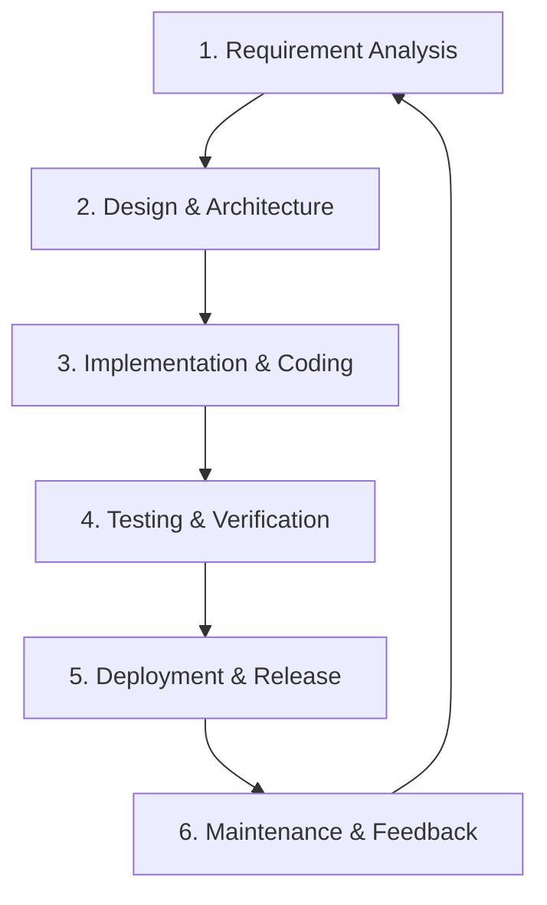

# Nexus Business Platform - Software Development Life Cycle (SDLC)

This document details the Software Development Life Cycle (SDLC) process for the **Nexus Business Platform (Employee Management System)**. It establishes development phases, coding standards, version control strategies, testing protocols, and release procedures to ensure high code quality, consistency, and reliability.

---

## 🗺️ SDLC Overview & Methodology

This project follows an **Iterative Agile Methodology**. We break down feature requests into sprints, allowing for continuous integration, frequent updates, and quick feedback loops.



---

## 📋 Phases of the SDLC

### 1. Requirements & Design
*   **Functional Goal**: Provide a lightweight, secure interface for managing employee directories (CRUD operations, filtering, pagination, status monitoring).
*   **System Layout**: Single Page Application (React) communicating via RESTful API with a decoupled web server (FastAPI) backed by a relational database (SQLite).

### 2. Development & Coding Guidelines
To maintain consistency and readability across the codebase, all contributors must adhere to the following standards:

#### 🐍 Backend (Python / FastAPI)
*   **Coding Standards**: Conform to [PEP 8 guidelines](https://peps.python.org/pep-0008/).
*   **Type Hinting**: Always use Python type hints to assist Pydantic validations and enable static type check tooling.
*   **Data Validation**: All incoming requests and outgoing responses must be modeled using Pydantic schemas in `schemas.py`. Never expose database models directly; use corresponding `Response` schemas.
*   **Docstrings**: Document all routes, CRUD functions, and utilities using standard Google-style docstring format:
    ```python
    def get_employee(db: Session, employee_id: int):
        """
        Retrieves a single employee record from the database.
        
        Args:
            db (Session): The active database session.
            employee_id (int): ID of the employee to retrieve.
            
        Returns:
            Employee: The SQLAlchemy model instance or None.
        """
        return db.query(models.Employee).filter(models.Employee.id == employee_id).first()
    ```

#### ⚛️ Frontend (React / Vite)
*   **Component Structure**: Functional components using hooks. Keep components focused, modular, and nested in `src/components/`.
*   **File Naming**: Use PascalCase for components (e.g., `EmployeeList.jsx`, `EmployeeForm.jsx`) and camelCase for logic/helper scripts (e.g., `api.js`).
*   **Styling**: Use the design system tokens defined in [index.css](file:///c:/Users/jaive/Desktop/Employee_Management/frontend/src/index.css). Do not insert arbitrary, inline styles unless calculating dynamic variables.
*   **Linting**: Run `npm run lint` regularly. ESLint configuration in `eslint.config.js` is strictly enforced.

---

### 3. Git & Branching Strategy
We implement a **Feature Branch Workflow**. Direct pushes to the `main` branch are restricted.

```text
main         ================================================== (Production)
              \                                 /
develop        \=== [Hotfix] ===/==============/======= (Staging / Testing)
                \             /               /
feature/emp-api  \===========/               / (Developer Work)
```

#### Branch Naming Conventions
*   **Features**: `feature/short-description` (e.g., `feature/add-department-filter`)
*   **Bug Fixes**: `bugfix/short-description` (e.g., `bugfix/fix-email-validation`)
*   **Hotfixes**: `hotfix/short-description` (e.g., `hotfix/cors-origin-fix`)

#### Commit Message Standard
Commits must be descriptive and follow the [Conventional Commits](https://www.conventionalcommits.org/) format:
*   `feat: add delete confirmation popup`
*   `fix: resolve SQLite thread concurrency issue`
*   `docs: update SDLC guidelines`
*   `test: introduce validation tests for emails`

#### Pull Request (PR) Requirements
Before merging a branch into `develop` or `main`:
1.  **Code Review**: At least one peer review approval.
2.  **Lint Check**: Backend and frontend code must pass lint processes.
3.  **Test Verification**: All `pytest` tests must pass.
4.  **Database Migration**: Any schema alterations must be accompanied by database update instructions or migrations.

---

### 4. Testing & Quality Assurance
Quality assurance is integrated into every phase of the development lifecycle.

*   **Unit & Integration Tests**: Backend changes must include test cases inside `test_api.py`.
*   **Test Command**: Run backend tests via `pytest` command. Keep coverage above 85%.
*   **Manual Testing UI Checkpoints**:
    *   Verify cross-browser responsiveness (Chrome, Safari, Firefox).
    *   Verify modal operations (overlay clicks, escape key triggers).
    *   Confirm search input triggers API debounces rather than flooding database queries.

---

### 5. Deployment & Release Flow

#### A. Development (Local)
*   Database: Local SQLite file (`backend/business.db`).
*   Servers: FastAPI running on `localhost:8000`, React running on `localhost:5173`.

#### B. Staging (Continuous Integration / Preview)
*   Every Pull Request to `develop` spins up a staging preview environment.
*   An automated script runs `backend/seed.py` to ensure fresh seed data is populated for functional inspection.

#### C. Production
*   Built and packaged using the standard Vite compiler (`npm run build`).
*   Static assets are served via Nginx or Cloudflare CDN.
*   The FastAPI application is deployed behind a reverse proxy (like Nginx) using Gunicorn with Uvicorn workers.
*   SQLite database must be regularly backed up, or migrated to PostgreSQL/MySQL if horizontal scaling is required.

---

### 6. Maintenance & Monitoring

*   **API Versioning**: Prefix routes with `/v1/` (e.g., `/v1/employees/`) for future updates to ensure backward compatibility.
*   **Database Backups**: Automated cron tasks should compress and backup `business.db` daily.
*   **Logging**: Backend endpoints should log application flow, errors, and system activities to rotating logs.
